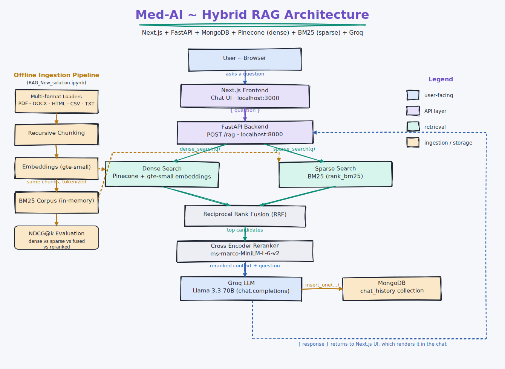
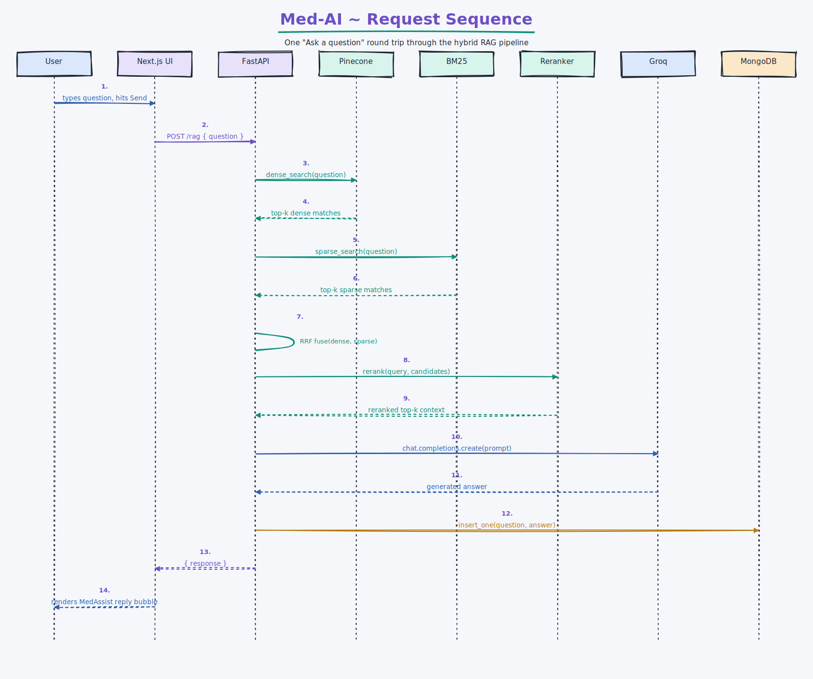

# 🩺 Med-AI

**A hybrid-retrieval medical AI assistant** — ask a health question, get an answer grounded in real medical text via dense + sparse retrieval, rank fusion, and cross-encoder reranking before it ever reaches the LLM.


---

## ✨ What makes the retrieval "hybrid"

| Stage | What it does |
|---|---|
| 🟠 **Dense search** | Pinecone + `BAAI/bge-small-en-v1.5` embeddings — catches semantic similarity |
| 🟡 **Sparse search** | BM25 (`rank_bm25`) over the same chunks — catches exact keyword/acronym matches dense search misses |
| 🔴 **Rank fusion** | Reciprocal Rank Fusion (RRF) merges both ranked lists without needing comparable score scales |
| 🟤 **Reranking** | A cross-encoder (`ms-marco-MiniLM-L-6-v2`) rescopes the fused candidates for the final, sharpest ordering |
| 🟢 **Evaluation** | NDCG@k compares dense-only vs. sparse-only vs. fused vs. reranked, so the pipeline's gains are measurable, not just assumed |

This pipeline was originally developed and evaluated in [`RAG_New_solution.ipynb`](./RAG_New_solution.ipynb); it's now also what actually serves production traffic — `backend/retrieval.py` runs the same dense + BM25 + RRF + cross-encoder rerank stack for every live `/rag` request (previously the backend only did plain dense-only search, a gap that's now closed). The notebook remains the place to experiment with ingestion, chunking, and retrieval changes before they're ported into the backend.

---

## 🏗️ Architecture



---

## 🔁 Request sequence

One "ask a question" round trip, end to end:



---

## 🧱 Stack

- **Frontend:** Next.js (React) — chat UI, calls the backend directly
- **Backend:** FastAPI — `POST /rag`, `GET /eval`
- **Database:** MongoDB — chat history (`chat_history` collection), including per-query confidence + sources
- **Vector store:** Pinecone — dense embeddings (`BAAI/bge-small-en-v1.5`, same model used at ingestion and query time)
- **Sparse index:** BM25 (`rank_bm25`) — built in-memory by the backend at startup
- **LLM:** Groq (`llama-3.3-70b-versatile`)
- **Reranker:** `cross-encoder/ms-marco-MiniLM-L-6-v2` — runs on every live query in `backend/retrieval.py`

## 📂 Ingestion

`backend/ingest.py` (shared loading/chunking code in `backend/ingestion.py`, also used by the notebook) loads a folder of mixed-format files (`.txt`, `.md`, `.pdf`, `.docx`, `.html`/`.htm`, `.csv`) from `./data`, chunks them, embeds them, and upserts them into Pinecone with `doc_id` metadata. Run it manually whenever `./data` changes:

```bash
cd backend
python ingest.py
```

The backend rebuilds the same chunk corpus from `./data` at startup (cheap — just loading + splitting, no re-embedding) to build its in-memory BM25 index and to resolve `doc_id`s for the `/eval` benchmark.

## 📊 Live endpoints

- `POST /rag` — `{"question": "..."}` → `{"response": "...", "confidence": 0.0-1.0, "sources": ["..."]}`. `confidence` is a sigmoid-squashed cross-encoder rerank score for the top retrieved chunk — a proxy signal for how well-grounded the answer is, logged to `chat_history` for every query. It is **not** NDCG: NDCG needs labeled ground truth, which doesn't exist for arbitrary live questions.
- `GET /eval` — runs the real NDCG@5 benchmark (dense-only / sparse-only / hybrid-fused / hybrid-reranked) against a fixed, labeled query set (`backend/eval.py`), for checking retrieval-quality regressions on demand.

## ✅ CI

Four workflows under [`.github/workflows/`](.github/workflows/), each scoped to only the paths it cares about:

| Workflow | Runs on | What it checks |
|---|---|---|
| `backend-ci.yml` | changes under `backend/**` | `ruff check backend` + `pytest backend/tests` — fast, no external services (only pure functions in `ranking.py` and pydantic schemas are under test, so no Pinecone/Groq/Mongo secrets needed) |
| `frontend-ci.yml` | changes under `frontend/**` | `npm run lint` (ESLint) + `npm run build` |
| `ndcg-eval.yml` | changes under `backend/**` or `data/**` | `backend/check_eval.py` — the real NDCG@5 benchmark against the labeled query set; fails if `hybrid_reranked` drops below `NDCG_FLOOR`. Needs a `PINECONE_API_KEY` repository secret (Settings → Secrets and variables → Actions) pointing at the same index `backend/ingest.py` populates |
| `docker-build.yml` | changes touching either app or `docker-compose.yml` | builds both Dockerfiles to catch breakage early; images aren't pushed anywhere yet since there's no registry/hosting wired up |

All four also support manual runs via `workflow_dispatch`. There's no CD (deployment) yet — `docker-build.yml` is the natural place to add a registry push once a host is picked.

## 🚀 Running locally

### Backend

Run these from the **repo root** (not from inside `backend/`) — `./data` is resolved relative to
the current working directory, and it lives at the repo root alongside `backend/`, matching how
the Docker image lays things out (`data/` copied next to the app files, see `backend/Dockerfile`):

```bash
pip install -r backend/requirements.txt
python backend/ingest.py                              # one-time: populate Pinecone (needs PINECONE_API_KEY set)
uvicorn main:app --reload --port 8000 --app-dir backend
```

`retrieval.py` loads `./data` and builds the BM25 index at import time, so `ingest.py` must have
been run at least once against the same Pinecone index before starting the server.

Environment variables (see `.env`):

- `PINECONE_API_KEY`, `PINECONE_ENV`
- `GROQ_API_KEY`, `GROQ_MODEL`
- `MONGODB_URI`, `MONGODB_DB_NAME`

### Frontend

```bash
cd frontend
npm install
npm run dev
```

Set `NEXT_PUBLIC_API_URL` (e.g. `http://localhost:8000/rag`) if the backend isn't proxied.

### With Docker

```bash
docker compose up --build
```

Brings up `mongo`, `backend` (FastAPI, port 8000) and `frontend` (Next.js, port 3000) together.
